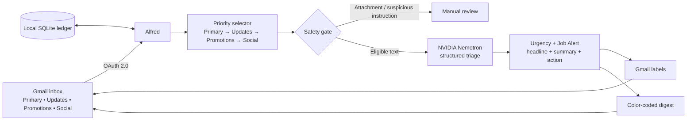

# Alfred — Your AI Gmail Triage & Job Alerts Agent

> **Read one briefing instead of fifty emails.**

Alfred is a privacy-conscious Gmail agent that sorts unread mail where it already lives: in Gmail. It labels what needs attention, highlights job opportunities, and delivers a beautifully structured briefing twice a day.

[](https://www.python.org/)
[](https://developers.google.com/gmail/api)
[](https://build.nvidia.com/)


## What Alfred does

- Reads unread messages from **Primary, Updates, Promotions, and Social** inbox tabs.
- Applies Gmail labels: **Urgent**, **Can Wait**, **FYI Only**, and **Job Alerts**.
- Detects jobs, internships, open roles, hiring, referrals, assistantships, and career opportunities.
- Sends a digest at **7:00 AM** and **7:00 PM** (local Windows time).
- Links every digest subject directly back to its Gmail conversation.
- Repeats only unread **Urgent** items; Job Alerts, Can Wait, and FYI items appear once.
- Keeps unsafe attachment-heavy or prompt-injection-like emails out of AI processing.

## The experience

| In Gmail | In Alfred's briefing |
| --- | --- |
| Clear urgency and job labels beside messages | Color-coded sections in priority order |
| No new dashboard to learn | Clickable subject opens the original Gmail thread |
| Inbox stays the source of truth | Sender, subject, headline, summary, and next action are separate and readable |

The digest sections are deliberately ordered for fast scanning:

| Section | Color | Meaning |
| --- | --- | --- |
| Urgent | Red | Needs attention now; repeats while unread |
| Job Alerts | Blue | Roles, internships, hiring, career and referral opportunities |
| Can Wait | Yellow | Important, but not time-critical |
| FYI Only | Green | Informational; no action needed |

## Architecture



## Methodology

1. **Select** — Alfred finds unread inbox messages, prioritizing Primary before the other Gmail tabs.
2. **Protect** — Attachments and suspicious instructions are held for manual review; Alfred never opens links, downloads files, replies, or forwards mail.
3. **Understand** — NVIDIA Nemotron returns structured triage data: urgency, job-alert status, headline, summary, and required action.
4. **Act minimally** — Alfred only adds its Gmail labels and sends a digest to the authorized mailbox.
5. **Remember** — A local SQLite ledger prevents duplicate non-urgent digests. Unread Urgent items remain visible until you open them.

## Example output

```text
[Urgent] Render — Build failed for DeepLearningProject
Headline: Deployment failure
Action: Review build logs and fix the deployment.

[Job Alert] LinkedIn Job Alerts — Data Science Intern roles
Headline: Internship opportunities
Action: Open the job listings and apply to relevant roles.
```

In the digest, the subject is a clickable Gmail link, so Alfred tells you what matters without separating you from the original message.

## Run locally

### 1. Prerequisites

- Python 3.10 or newer
- A Gmail account
- A Google Cloud project
- A free NVIDIA Developer account and your own NVIDIA API key

> Never use another person's API key. Each user must create their own NVIDIA API key at [build.nvidia.com](https://build.nvidia.com/), using **Get API Key** on a model page. Alfred defaults to `nvidia/nemotron-3.5-lightning-30b-a3b`.

### 2. Clone and install

```powershell
git clone https://github.com/SSGOG/Alfred---Your-AI-Gmail-Triage-Job-Alerts-Agent.git
cd Alfred---Your-AI-Gmail-Triage-Job-Alerts-Agent
python -m pip install -r requirements.txt
Copy-Item .env.example .env
notepad .env
```

Set these values in `.env`:

```env
GMAIL_ACCOUNT=your-email@gmail.com
AI_PROVIDER=nvidia
NVIDIA_API_KEY=paste-your-own-nvidia-key-here
NVIDIA_MODEL=nvidia/nemotron-3.5-lightning-30b-a3b
MAX_MESSAGES_PER_RUN=100
```

### 3. Create Gmail OAuth credentials

1. Create a project in [Google Cloud Console](https://console.cloud.google.com/).
2. Enable the **Gmail API**.
3. Under **Google Auth Platform**, configure the consent screen.
   - Personal Gmail users should choose **External** and add their Gmail address under **Test users**.
4. Create an OAuth client of type **Desktop app**.
5. Download its JSON file, rename it to `credentials.json`, and place it in the project root.

### 4. Authorize and preview

```powershell
$env:PYTHONPATH="src"
python -m alfred --healthcheck
python -m alfred --dry-run
```

The first run opens Google sign-in. Approve access for the same address used in `GMAIL_ACCOUNT`.

Review the preview before running live:

```powershell
python -m alfred
```

### 5. Schedule twice-daily briefings

On Windows:

```powershell
powershell -ExecutionPolicy Bypass -File .\scripts\install-schedule.ps1
```

This installs two local tasks at **07:00** and **19:00**. Keep your computer on; Windows will run a missed task when it becomes available.

## Commands

| Command | Purpose |
| --- | --- |
| `python -m alfred --healthcheck` | Validate local configuration |
| `python -m alfred --dry-run` | Preview triage without changing Gmail |
| `python -m alfred` | Apply labels and send a digest |
| `python -m alfred --backfill-job-alerts` | Label previously triaged job-related messages without resending them |

## Security and privacy

- `.env`, `credentials.json`, and `token.json` are intentionally ignored by Git.
- OAuth scopes are limited to Gmail read, label modification, and sending Alfred's digest.
- Mail content is treated as untrusted input, never as instructions.
- Alfred does not open external links, access attachments, reply, forward, delete, archive, or move email.
- Model responses use structured JSON, retries, and a metadata-only fallback for troublesome email bodies.
- Gmail and NVIDIA rate-limit handling avoids abrupt runs and retries remaining work later.

## Project structure

```text
src/alfred/main.py       Core Gmail, AI, safety, labels, digest, and scheduling logic
scripts/install-schedule.ps1
tests/test_security.py   Safety, priority, job-label, and digest tests
.env.example             Safe configuration template
```

## Built for

**Agents, Everywhere: Bots, Channels, & More**  
AI Tinkerers × OpenAI Hackathon — Gmail / Email category

**One-line pitch:**  
*Alfred lives in Gmail, triages what matters, surfaces career opportunities, and turns inbox overload into one actionable briefing.*

